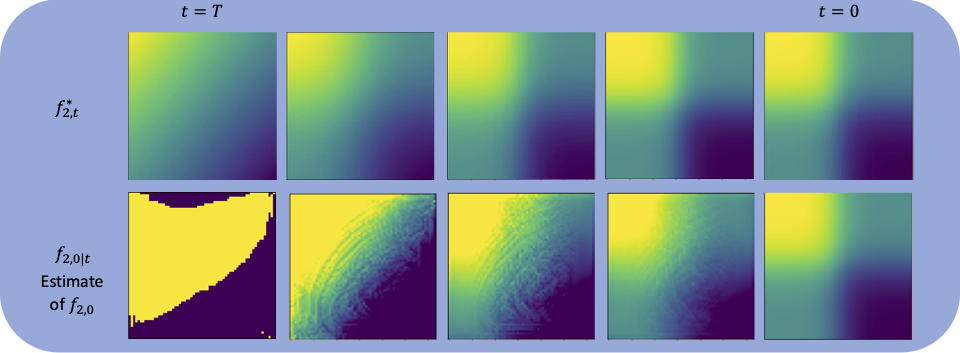

# Manifold Guided Stabilizing Control

<p align="center">
  
</p>

An impementation of diffusion models (DDIM) for the stabilization of non-linear systems, modified from [minimal-diffusion](https://github.com/VSehwag/minimal-diffusion)

### Structure

```
main.py  - Train or sample from a diffusion model.
data_generation_control.py  - Generate the dataset of stabilizing controllers (Requires lyznet to be installed)
unets.py - UNet based network architecture for diffusion model.
data.py  - Common datasets and their metadata.
restoration_control.py - Has the implemetation of 2D nonlinear systems and uses a pre-trained diffusion model to control it.
──  scripts
     └── train.sh  - Training scripts for all datasets.
     └── sample.sh - Sampling scripts for all datasets.
```

### Training
Use the following command to train the diffusion model on four gpus.

```
CUDA_VISIBLE_DEVICES=0,1,2,3 python -m torch.distributed.launch --nproc_per_node=4 main.py \
  --arch UNet --dataset lyapunov --epochs 500
```

### Control
We use `restoration_control.py` for controlling a system using a pretrained diffusion model. 

```
CUDA_VISIBLE_DEVICES=0 python restoration_control.py \
    --arch UNet --dataset lyapunov --system noisy_pendulum --sampling-steps 250 \
    --pretrained-ckpt ./trained_models/path_to_saved_model.pt --save-dir ./sampled_images/
```

## Results

#### Noisy Inverted Pendulum
<p align="center">
  
</p>

#### Damped Duffing Oscillator
<p align="center">
  
</p>

#### Van Der Pol Oscillator
<p align="center">
  
</p>
